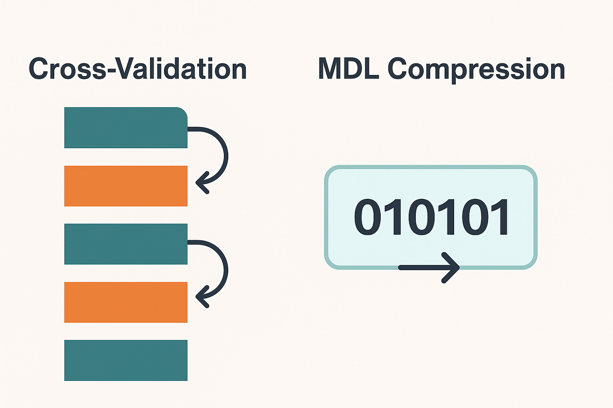
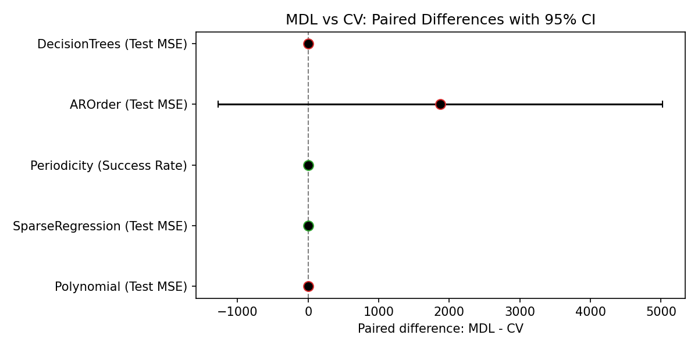
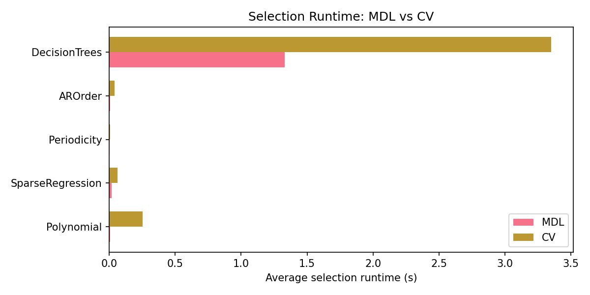

# To Split or Not to Split

> TL;DR: Don’t split by default. For many model-selection tasks, Minimum Description Length (MDL) can replace inner validation/CV while matching performance and saving compute. Always keep an external holdout for honest reporting.

<div align="center">
  
</div>

The first commandment of machine learning: *thou shalt split thy data* or risk overfitting disasters. But what if this sacrifice isn't always required?

Most practitioners reach for scikit-learn’s `train_test_split` reflexively – yet this universal practice has three fundamental limitations:

1. **Computational cost**: Even basic 5-fold CV requires training 5 separate models. For hyperparameter tuning across multiple parameters, this quickly multiplies to hundreds of model fits.
2. **Inner-split overhead**: Inner validation via CV trains K models per candidate; MDL selects in a single training pass. Both still keep an external holdout for honest reporting.
3. **Split variance**: Performance can depend on fold assignments; CV reduces but doesn’t eliminate this variance.

This study compares this standard approach with an alternative from information theory: **Minimum Description Length (MDL)**. Instead of splitting data, MDL selects models based on compression efficiency – the model that produces the shortest description of your data wins. This repo provides a clean, reproducible comparison between MDL-style selection and K-fold CV across diverse tasks.

Our aim is provocative but fair: show that you can select without splitting, and still generalize.

---

## Two Philosophies of Model Selection

### Data Splitting & Cross‑Validation
Split your data, train on one part, test on another. Simple and direct – you literally measure how well your model generalizes. Cross-validation extends this by trying multiple splits, but in practice, most people stick with a single train-test split.

### The Alternative: MDL 
MDL selects models based on compression: good models compress data well. It measures the total bits needed to describe both the model itself and the data given that model. This creates a natural trade-off - complex models take more bits to describe but may compress data better, while simple models are cheap to describe but might compress poorly. The model with the shortest total description wins.

MDL's advantage emerges from its information-theoretic foundation: compression naturally favors simple explanations, providing principled protection against overfitting noise.

## What We Test

To verify that MDL can stand in for inner validation/CV, we run a small set of simple, focused experiments. In each one, we do the same thing the way most practitioners do it — split into train and test — but we change only the selection step:

- On the training set, pick the model with either MDL (e.g., BIC or an explicit code‑length) or K‑fold CV.
- On the test set, evaluate that chosen model once to report honest performance.

This isolates the question “how do we pick the model?” without changing anything else. We compare test error (lower is better) or success rate (higher is better), and we also report the complexity of the chosen model and the time it took to select it.

- Polynomial degree selection (synthetic cubic): MDL via BIC vs 5-fold CV
- Sparse linear regression (synthetic ground truth): BIC on Lasso path vs LassoCV; selection accuracy included
- Periodicity in noisy binary sequences: explicit code-length vs leave-one-out majority predictor
- AR(p) order selection (time series): BIC vs rolling-origin CV; multi-step forecast evaluation
- Decision tree pruning (regression): BIC with leaf-count penalty vs 5-fold CV

Each task runs 30 paired replicates by default with identical seeds for MDL and CV. We report paired differences with 95% CI, Cohen’s d, Wilcoxon p-values, Holm-corrected t-tests, and selection runtime.

---

## How to Reproduce

uv handles dependencies via inline script metadata — no pyproject needed.

If you don’t have `uv` installed:

```
# Install uv quickly via pipx
pipx install uv
```

Note: the California Housing dataset will download on first run.

Run everything:

```
uv run experiments.py --task all --runs 30 --seed 0
```

Or a specific task, e.g. polynomials:

```
uv run experiments.py --task polynomial --runs 50 --seed 1
```

Outputs:

- `results.json`: full per-task/per-replicate metrics
- `results_summary.csv`: paired diffs, stats, runtimes
- `results_forest.png`: forest plot of MDL−CV paired differences with 95% CI
- `results_runtime.png`: selection runtime comparison

---

## Design, Fairness, and Assumptions

- Outer evaluation uses a strict train/test holdout for unbiased reporting. MDL replaces only the inner validation/CV step used for selection.
- External holdout: a separate test set used only once at the end for unbiased performance reporting; selection is done on the training set only.
- Replicated Monte Carlo splits: paired comparisons with identical seeds for methods.
- BIC≈MDL under iid Gaussian errors with MLE; we use this proxy for polynomials, sparse regression (on the Lasso path), and trees (approximate, residuals may be non-Gaussian). Periodicity uses an explicit code-length (pattern + log₂(period) + entropy of flips). AR(p) uses standard BIC.
- CV uses seeded `KFold(shuffle=True)` (or rolling-origin for time series). We record selection runtime and approximate number of fits for compute comparisons.

---

## Interpreting the Results

- Forest plot shows paired mean differences (MDL−CV) with 95% CI per task.
  - In all plots and CSVs, paired difference = MDL − CV.
  - For error metrics (MSE), negative favors MDL; for accuracy metrics, positive favors MDL.
- We report: Cohen’s d (paired), paired t-test p-values, Holm-corrected p-values across tasks, and Wilcoxon p-values as a robustness check.
- Expect parity on mainstream tasks; advantage for MDL in structured/noisy or temporal settings due to better regularization or more natural criteria.

### Current Results (30 runs)

- Parity: Polynomial, Decision Trees, AR(p).
- MDL advantage trend: Periodicity; slight MDL edge in Sparse Regression (synthetic).
- Compute: MDL is faster across tasks and uses fewer fits (see runtime plot).

<div align="center">
  
  <p><em>Paired difference: MDL minus CV. For MSE, negative is better for MDL; for accuracy, positive is better for MDL.</em></p>
</div>

<div align="center">
  
  <p><em>Average selection runtime per task. MDL generally requires fewer fits and runs faster.</em></p>
</div>

---

## When to Prefer MDL vs CV

- MDL shines: small-N, structured noise, time series, unsupervised model count selection (e.g., AR order, GMM components), when compute is tight.
- CV is fine: large-N, complex/nonparametric black-boxes, heavy misspecification concerns, or when direct predictive risk estimation is the primary goal.

---

## Technical Notes

- Polynomial: parameters k = degree + 1 (intercept included). Pipeline uses `include_bias=False` to align k.
- Sparse regression: `LassoLarsIC(criterion='bic')` for MDL-like selection; uses a path approximation. We report support F1 on synthetic ground truth as a selection-accuracy proxy.
- Trees: BIC penalty uses number of leaves (parameters) rather than internal nodes.
- AR(p): BIC selection vs rolling-origin cross-validation; evaluated on multi-step test forecasts.
- Periodicity: explicit MDL code length with entropy-coded flip positions; CV uses leave-one-out majority predictor with Occam tie-breaker.

---

## 📚 MDL

### The Philosophy Behind the Math

What if Occam's Razor could be computed? MDL operationalizes the principle that simpler explanations are more likely to be true.

MDL selects models by minimizing: `L(model) + L(data|model)`

**Example**: Describing the dataset {(1,100), (2,200), (3,300), (4,400)}

```
Option 1: Store Raw Data
------------------------
• Store 8 numbers: 1,100,2,200,3,300,4,400
• Cost: 8 integers × 4 bytes = 32 bytes

Option 2: MDL Approach  
----------------------
• Store model: "y = 100x" (L(model) = 8 bytes)
• Store x-values only: 1,2,3,4 (L(data|model) = 16 bytes)
• MDL = L(model) + L(data|model) = 8 + 16 = 24 bytes

MDL chooses Option 2 (more compression = better model)
```

### Why BIC ≈ MDL?

The Bayesian Information Criterion closely approximates MDL for exponential family distributions:

```
BIC = n · log(RSS/n) + k · log(n)  (+ constant)
```

Where n = sample size, RSS = residual sum of squares, and k = number of free parameters. In Gaussian regression, MSE = RSS/n so the forms are equivalent up to a constant; for GLMs, BIC applies to deviance (−2 log-likelihood). Both BIC and MDL balance fit against complexity and can coincide under regularity conditions.

---

## Limitations

These MDL criteria are proxies (mostly BIC). Under heavy model misspecification or non‑Gaussian noise, results may differ; time-series CV and explicit code-lengths help but are still approximations.

## References

- Grünwald, P., & Roos, T. (2019). Minimum Description Length revisited. IJMI.
- Rissanen, J. (1978). Modeling by shortest data description.
- Stone, M. (1977). CV and AIC asymptotic equivalence.
- Shao, J. (1997). Linear model selection theory.

---

Next time you split your data, ask: do I need to — or am I just following habit?
