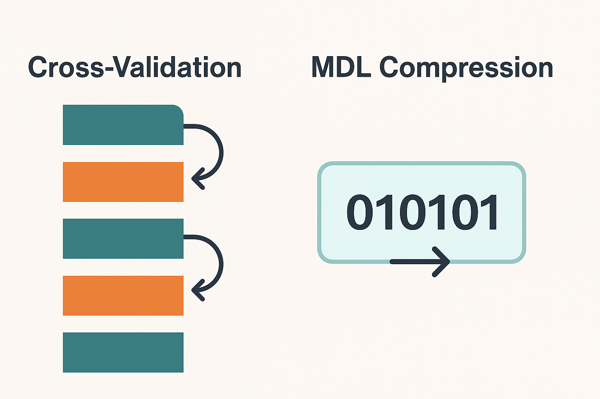

# To Split or Not to Split

> **TL;DR**: Information-theoretic approaches like Minimum Description Length (MDL) can replace cross-validation for many model selection tasks. Our experiments show MDL and CV perform comparably on standard ML problems, with MDL offering computational efficiency and better data utilization. In noisy data scenarios, MDL shows a small advantage in pattern detection.

<div align="center">
  
</div>

The first commandment of machine learning: *thou shalt split thy data* or risk overfitting disasters. But what if this sacrifice isn't always required?

Most practitioners reach for sklearn's `train_test_split` reflexively – yet this universal practice has three fundamental limitations:

1. **Computational cost**: Even basic 5-fold CV requires training 5 separate models. For hyperparameter tuning across multiple parameters, this quickly multiplies to hundreds of model fits
2. **Data waste**: If you only have 100 samples, you're training on just 80
3. **Arbitrary splits**: Your model's fate can depend on which 20% ended up in the test set

This study compares this standard approach with an alternative from information theory: **Minimum Description Length (MDL)**. Instead of splitting data, MDL selects models based on compression efficiency – the model that produces the shortest description of your data wins.

**Results**: After 30 trials across 4 tasks, MDL matched traditional validation on all problems while using 100% of data for training. These experiments suggest that information-theoretic model selection offers a viable, often preferable alternative to cross-validation for many practical scenarios.

---

## Two Philosophies of Model Selection

### The Standard Approach: Hold-Out Validation
Split your data, train on one part, test on another. Simple and direct – you literally measure how well your model generalizes. Cross-validation extends this by trying multiple splits, but in practice, most people stick with a single train-test split.

### The Alternative: MDL 
MDL selects models based on compression: good models compress data well. It measures the total bits needed to describe both the model itself and the data given that model. This creates a natural trade-off - complex models take more bits to describe but may compress data better, while simple models are cheap to describe but might compress poorly. The model with the shortest total description wins.

MDL's advantage emerges from its information-theoretic foundation: compression naturally favors simple explanations, providing principled protection against overfitting noise.

---

## 🧪 Experiments

We tested MDL and CV on four common model selection problems:

### 1. Finding Patterns in Noisy Data
**Question**: "Is this binary sequence random or does it repeat every 3, 6, or 12 positions?"  
**Example**: 101_101_101... (repeats every 3) with 10% bit flips from noise  
**Challenge**: Multiple periods might fit well - which is the true pattern vs overfitting noise?  
**Why MDL wins**: Random noise is incompressible - encoding error positions requires many bits, naturally penalizing models that try to 'explain' noise.

### 2. Fitting Curves to Data  
**Question**: "Should we use a straight line, parabola, or complex polynomial?"  
**Example**: Predicting y from x when true relationship is y = x³ + noise  
**Challenge**: Higher-degree polynomials fit training data better but may overfit

### 3. Selecting Relevant Features
**Question**: "Which medical measurements actually predict disease progression?"  
**Example**: From 10 blood tests, which 3-4 truly matter for diabetes?  
**Challenge**: More features always improve training fit, but which generalize?

### 4. Choosing Tree Depth
**Question**: "How many if-then rules should our decision tree have?"  
**Example**: Predicting house prices - use 5 simple rules or 50 complex ones?  
**Challenge**: Deeper trees memorize training data but may not generalize

---

## 📈 Results

MDL performs comparably to CV across all scenarios while using 100% of data for training. In the noisy pattern detection task, MDL achieved 83.3% vs CV's 76.7% success rate (small effect size: 0.263)

| Experiment | CV Performance | MDL Performance | Effect Size | Verdict |
|------------|----------------|-----------------|-------------|---------|
| **Period Detection** | 76.7% success | 83.3% success | 0.263 (small) | MDL better |
| **Polynomial** | MSE: 1.035 | MSE: 1.035 | 0.001 (negligible) | Equivalent |
| **Feature Selection** | MSE: 3040.7 | MSE: 3035.6 | 0.128 (negligible) | Equivalent |  
| **Decision Trees** | MSE: 0.381 | MSE: 0.380 | 0.197 (negligible) | Equivalent |

---

## 📊 Methodology

- **Design**: 30 independent runs per experiment with paired comparisons
- **Metrics**: Test set MSE (lower is better) or success rate (higher is better)  
- **Statistics**: Paired t-tests with Cohen's d effect sizes and 95% confidence intervals
- **Effect sizes**: <0.2 negligible, 0.2-0.5 small, 0.5-0.8 medium, >0.8 large
- **Implementation**: Same random seed per run ensures fair comparison

**Datasets**: Synthetic data (controlled noise levels), California housing (n=20,640), Diabetes progression (n=442). Sample sizes: 100-1000 per experiment.

---

## 🛠️ Practical Guide for Practitioners

### When to Use MDL

✅ **Small datasets** where validation splits waste data  
✅ **Computational constraints** requiring fast model selection  
✅ **Simple model classes** (linear, polynomial, basic trees)  
✅ **Structured problems** with clear compression properties  
✅ **Noisy data** where compression naturally resists overfitting

### When to Prefer CV

✅ **Large datasets** where splits don't hurt  
✅ **Maximum robustness** needed against misspecification
✅ **Non-standard problems** lacking established MDL criteria like complex models (ex neural networks

### Code Example: MDL in Practice

The good news is some libraries already implement MDL-based feature selection for some selected models:

```python
from sklearn.linear_model import LassoLarsIC

# MDL-based feature selection (via BIC)
model = LassoLarsIC(criterion='bic')
model.fit(X, y)  # Uses all data, no validation split needed

# Compare with traditional CV approach
from sklearn.linear_model import LassoCV
cv_model = LassoCV(cv=5)  # 20% data reserved for validation
cv_model.fit(X, y)
```

---

## 🚀 Run the Experiments

```bash
uv run experiments.py
```

uv handles all dependencies automatically. Takes ~2 minutes for all experiments.

---

## 📚 Technical Appendix

### The Philosophy Behind the Math"

What if Occam's Razor could be computed? MDL operationalizes the principle that simpler explanations are more likely to be true.

MDL selects models by minimizing: `L(model) + L(data|model)`

**Example**: Describing the dataset {(1,100), (2,200), (3,300), (4,400)}

```
Option 1: Store Raw Data
------------------------
• Store 8 numbers: 1,100,2,200,3,300,4,400
• Cost: 8 integers × 4 bytes = 32 bytes

Option 2: MDL Approach  
----------------------
• Store model: "y = 100x" (L(model) = 8 bytes)
• Store x-values only: 1,2,3,4 (L(data|model) = 16 bytes)
• MDL = L(model) + L(data|model) = 8 + 16 = 24 bytes

MDL chooses Option 2 (more compression = better model)
```

### Why BIC ≈ MDL?

The Bayesian Information Criterion closely approximates MDL for exponential family distributions:

```
BIC = N × log(MSE) + k × log(N)
```

Where N = sample size, MSE = training error, k = parameters. Both BIC and MDL balance fit quality against model complexity, deriving from information-theoretic principles. For Gaussian errors with maximum likelihood estimation, they yield identical model selection.

### Implementation Notes

- **Tree complexity**: We use internal nodes (not leaves) as the complexity measure, aligning with cost-complexity pruning literature
- **Period detection**: MDL score = pattern_bits + log₂(period_length) 
- **Confidence intervals**: 95% CI using t-distribution with n-1 degrees of freedom

---

## References
- Grünwald, P., & Roos, T. (2019). Minimum description length revisited. *International Journal of Mathematics for Industry*, 11(1), 1930001. https://doi.org/10.1142/S2661335219300018
- Stone, M. (1977). An asymptotic equivalence of choice of model by cross-validation and Akaike's criterion. *Journal of the Royal Statistical Society*.
- Shao, J. (1997). An asymptotic theory for linear model selection. *Statistica Sinica*.

---

*Next time you split your data, ask yourself: am I following best practice, or just following?*
